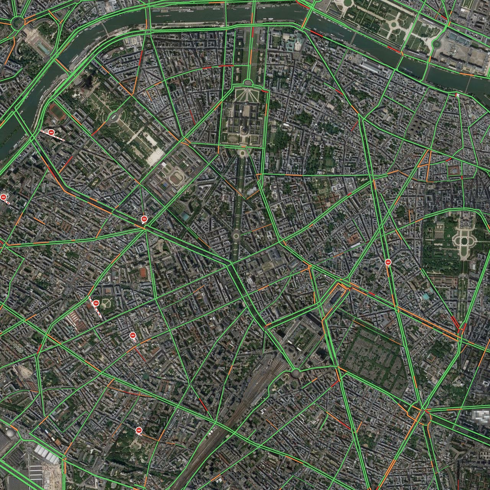

gtraffic-scraper - A scraping script for google maps traffic
===========================
This script allows you to scrape the Google Maps traffic images. Run only with Google permissions ;-)
## Pre-requisites
```sh
 $ [sudo] pip install Pillow BeautifulSoup4 fake-useragent
```
## Run
```sh
 $ python scraper.py [parameters]
```
## Options (positional arguments)
* Latitude
* Longitude
* Tile width
* Tile height
* Zoom level: 15 is recommended
* Seconds int week: -1 for realtime. It starts at midnight on Sunday and you can access the historical traffic values of the week
* Output file name
## Command example
```sh
 $ python scraper.py 48.864201 2.284322 5 5 15 -1 paris_region.png
```
## Output example

